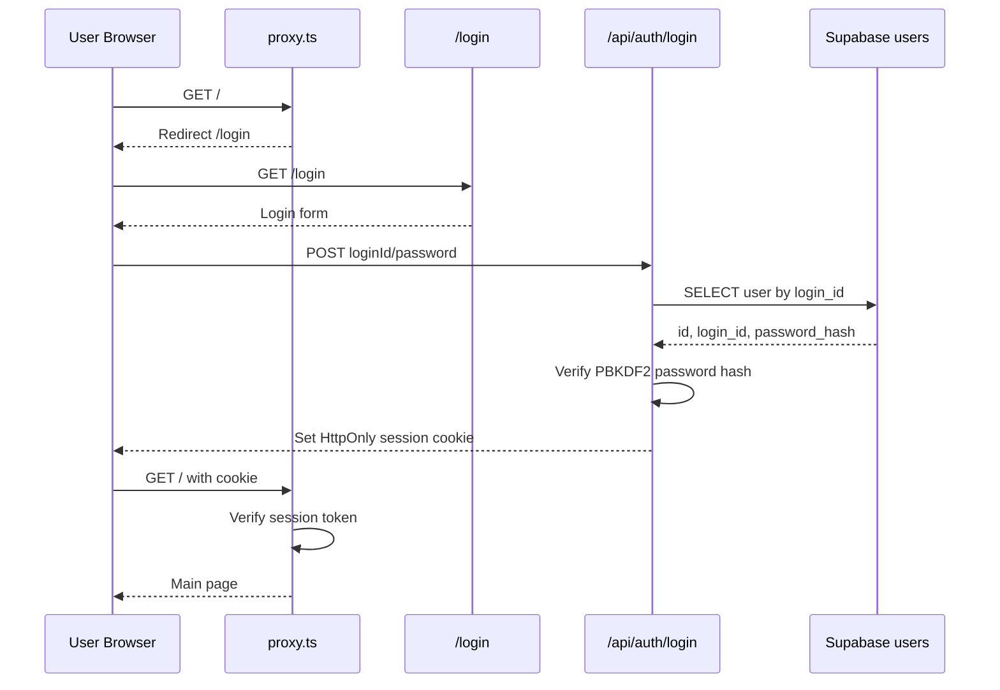
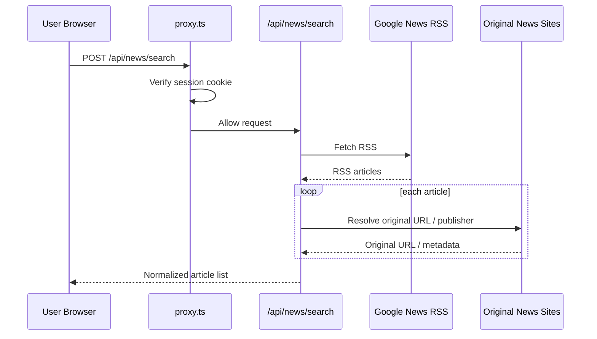
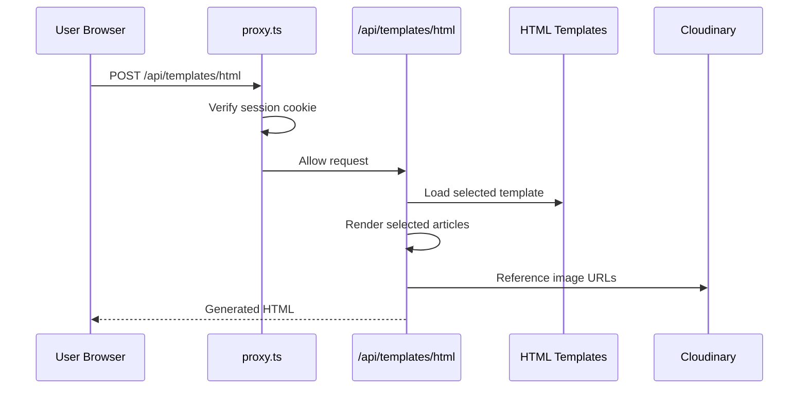

# Next 뉴스레터

뉴스 수집과 이메일 템플릿 생성을 위한 Next.js 프로젝트입니다.

## 주요 기능

- Google News RSS 기반 뉴스 수집
- 원문 기사 URL 및 실제 언론사명 보정
- 선택 기사 순서 조정
- Excel, Word, PDF 파일 다운로드
- 이메일 HTML 템플릿 생성 및 미리보기
- 로그인 후 메인 화면 및 API 접근 허용

## 실행

```bash
npm install
npm run dev
```

기본 개발 주소:

```text
http://localhost:3000
```

## 환경 변수

Vercel 배포 시 아래 환경 변수를 등록해야 합니다.

```text
NEXT_PUBLIC_SUPABASE_URL=https://<project-ref>.supabase.co
NEXT_PUBLIC_SUPABASE_ANON_KEY=<supabase-anon-key>
SUPABASE_SERVICE_ROLE_KEY=<supabase-service-role-key>
AUTH_SECRET=<session-signing-secret>
```

`AUTH_SECRET`은 세션 쿠키 서명에 사용하는 값입니다. 예측하기 어려운 긴 문자열로
설정하고 외부에 공개하지 않습니다.

## 인증 구조

로그인 전에는 무브랜드 로그인 화면만 노출합니다. 로그인 성공 후에만 메인 화면,
뉴스 수집 API, 템플릿 생성 API에 접근할 수 있습니다.

- 사용자 정보는 Supabase `users` 테이블에 저장합니다.
- 비밀번호는 평문이 아니라 `PBKDF2-SHA256 + salt` 해시로 저장합니다.
- 로그인 성공 시 `newsletter_session` HttpOnly 쿠키를 발급합니다.
- `proxy.ts`에서 세션 쿠키를 검증하고 보호 라우트 접근을 제어합니다.
- 인증되지 않은 API 요청은 `401 Unauthorized`를 반환합니다.

## 아키텍처

```mermaid
flowchart TB
    User[사용자 브라우저]

    subgraph Vercel[Vercel / Next.js]
        Proxy[proxy.ts<br/>인증 게이트]
        LoginPage[/login<br/>무브랜드 로그인 화면]
        MainPage[/<br/>뉴스레터 메인 화면]

        LoginAPI[/api/auth/login]
        LogoutAPI[/api/auth/logout]
        SearchAPI[/api/news/search]
        ResolveAPI[/api/news/resolve]
        TemplateAPI[/api/templates/html]

        Templates[HTML Email Templates]
    end

    subgraph Supabase[Supabase]
        Users[(users<br/>login_id / password_hash)]
    end

    subgraph External[외부 서비스]
        GoogleNews[Google News RSS]
        NewsSites[원문 뉴스 사이트]
        Cloudinary[Cloudinary 이미지 URL]
    end

    User --> Vercel
    Vercel --> Proxy

    Proxy -->|세션 없음| LoginPage
    Proxy -->|세션 있음| MainPage
    Proxy -->|세션 없는 API 요청| Deny[401 Unauthorized]

    LoginPage --> LoginAPI
    LoginAPI --> Users
    LoginAPI --> Cookie[HttpOnly Session Cookie]
    Cookie --> User

    MainPage --> SearchAPI
    MainPage --> ResolveAPI
    MainPage --> TemplateAPI
    MainPage --> LogoutAPI

    SearchAPI --> GoogleNews
    SearchAPI --> NewsSites
    ResolveAPI --> NewsSites
    TemplateAPI --> Templates
    TemplateAPI --> Cloudinary
```

## 시퀀스 다이어그램

### 로그인



### 뉴스 수집



### 이메일 템플릿 생성



## 보안 검토사항

### 적용된 보안 조치

- 로그인 전 화면은 회사명, 회사 로고, 서비스명을 노출하지 않는 무브랜드 화면입니다.
- 메타데이터 title/description과 favicon은 중립 값으로 설정했습니다.
- 메인 화면과 API는 `proxy.ts`에서 세션 쿠키를 확인한 뒤 접근을 허용합니다.
- 세션 쿠키는 HttpOnly, SameSite=Lax로 설정합니다.
- 운영 환경에서는 `secure` 쿠키로 설정되어 HTTPS에서만 전송됩니다.
- 비밀번호는 Supabase에 평문 저장하지 않고 `PBKDF2-SHA256 + salt` 해시로 저장합니다.
- API는 인증되지 않은 요청에 `401 Unauthorized`를 반환합니다.
- 검색엔진 노출 방지를 위해 metadata robots를 `noindex`, `nofollow`, `noarchive`로 설정했습니다.

### 운영 전 확인 필요

- Vercel 환경 변수에 `AUTH_SECRET`, `SUPABASE_SERVICE_ROLE_KEY`가 등록되어 있는지 확인합니다.
- `NEXT_PUBLIC_SUPABASE_URL`은 project id가 아니라 전체 URL 형식이어야 합니다.
- Vercel 환경 변수 변경 후 반드시 Redeploy합니다.
- Supabase `users` 테이블에 운영 계정이 생성되어 있어야 합니다.
- Supabase `users.password_hash`는 서비스 role로만 조회되도록 관리합니다.
- 가능하면 Supabase RLS를 활성화하고 anon key로 사용자 테이블을 직접 조회하지 못하게 제한합니다.
- Cloudinary 이미지 URL은 공개 URL이므로, 이메일 템플릿용으로 외부 공개 가능한 이미지만 사용합니다.
- 회사 로고/회사명 이미지가 로그인 전 HTML, JS bundle, favicon, metadata에 포함되지 않는지 배포 후 확인합니다.
- 사내망 또는 VPN 전용 운영이 필요하면 Vercel WAF/IP 제한을 추가 검토합니다.

### 알려진 제한사항

- 현재 로그인은 단일 앱 자체 인증 방식입니다. 사내 SSO 또는 Microsoft Entra ID 연동은 별도 구현이 필요합니다.
- Cloudinary 이미지 URL은 인증 보호를 받지 않습니다.
- Google News RSS와 원문 뉴스 사이트 접근은 외부 네트워크 상태에 영향을 받습니다.

## 최근 기록

최근 기록은 Supabase `history`, `history_details` 테이블에 저장합니다.
뉴스 수집이 완료되면 수집 기간, 기사 수, 기사 목록이 함께 저장되고, 사이드바의 최근 기록 항목을 누르면 해당 시점의 기사 목록을 다시 불러옵니다.
최근 기록으로 불러온 화면에서는 기존 날짜 조건을 그대로 보여주고, RUN 버튼 없이 파일 다운로드와 이메일 템플릿 생성을 이어서 사용할 수 있습니다.
